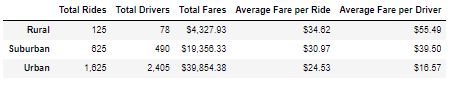
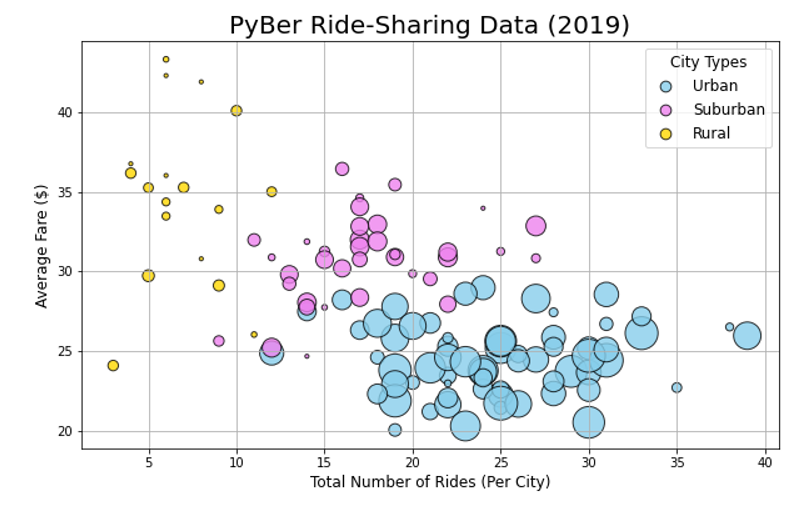
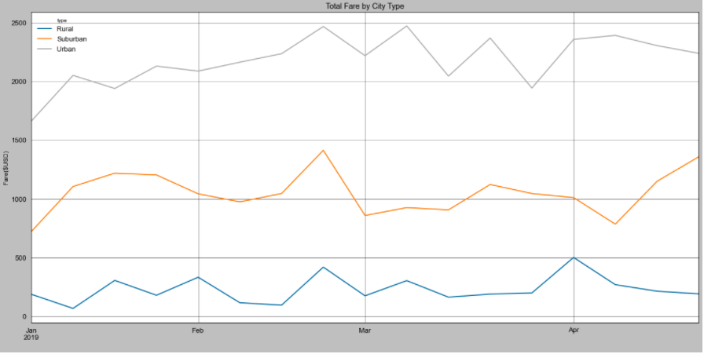

# PyBer_Analysis

## Overview

Omar and I have been hard at work exploring the massive amount of data available to us provided by the ride-sharing application PyBer. After much work, we were able to find and evaluate the relationships that exist between the type of city, number of drivers & riders and fares within those types of cities. The Exective team tasked us with specifically calling out examples where there may be stark contrast in affordability to customers in different city types, to aid their decision making. 

## Results

Looking at the overview from the ridesharing DataFrame below, the most profitable type of city for ridesharing for PyBer is the urban cities *($39,854.38)*, followed by suburban cities *($19,356.33)*, and the least profitable area is rural cities *($4,327.93)*. The opposite is true for the profitability for drivers, however, with rural being the most profitable based on the average fare per driver *($55.49)*. Followed by Suburban average fares per driver coming in at *($39.50)* and urban average fares per driver at *($16.57)*.

At a high level, in 2019, there is clearly a negative trend between the average fare of rides and the total number of rides in each city. Let's dig deeper as to why that might be!

The reason that the urban cities are more profitable for PyBer is because there is a greater quantity of rides; **1,625 for urban** compared to **625 for suburban** and **125 for rural** cites.  The number of drivers follows the same pattern, with the urban cities having the most drivers and rural cities having the least.

### ***A Closer Look***

The above graph takes a closer look at the fares by city type across the beginning part of 2019. The pattern continues to emerge in this visual from lowest fare to highest fare we see it mapped as rural, suburban, urban again.

## Summary

Based on the analysis, the following actions items are recommended for Executive Leadership:

-Recommend increasing the number of drivers in rural cities- offer promotion for hires or employee referral programs.  Rural cities fewer drivers available may be a contributing factor toward longer wait times, poor customer accessibility, and lower cumulative fares.

-Recommend placing controls in Urban city markets where there were more drivers than rides in this review period.  Limiting the drivers would raise both the average fare per ride and per driver; but it would be important to strike the right balance of maintaining a strong base of drivers to service the customers and without tipping the scales of 'too many drivers' again. 

-Recommend and increase of fares in Urban cities. This would increase revenue for PyBer, enabling the possibility for a shift in resources that would allow for fares to be potentially be lowered in Rural and Suburban cities; increasing PyBer's accessibility. 

	